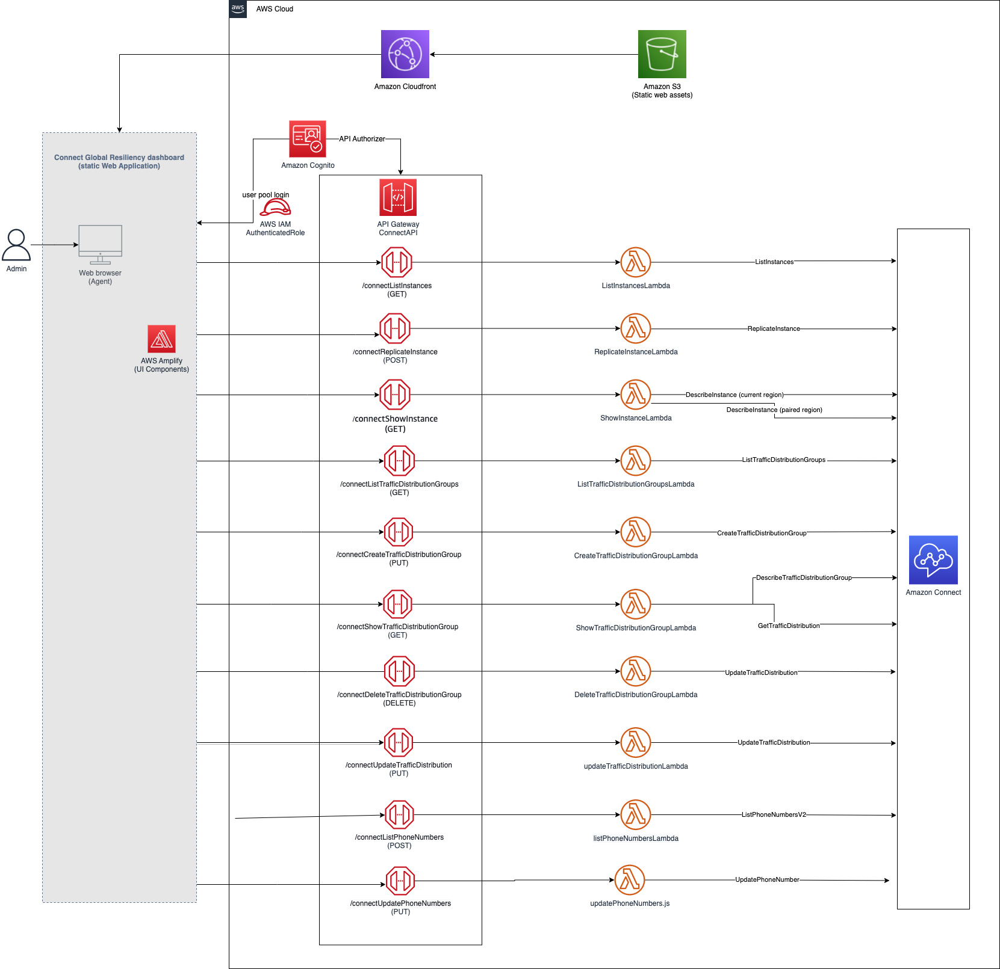

# Amazon Connect Global Resiliency dashboard starter project

>**BE AWARE:** This code base is an [Open Source](LICENSE) starter project designed to provide a demonstration and a base to start from for specific use cases. 
It should not be considered fully Production-ready.
If you plan to deploy and use this in a Production environment please review the [Using this in Production](#using-this-in-production) section at the end for some additional guidance.

## Use-case scenario

[Amazon Connect](https://docs.aws.amazon.com/connect/latest/adminguide/what-is-amazon-connect.html) is an omnichannel cloud contact center that allows you to set up a contact center in just a few steps. 

Using [Amazon Connect Global Resiliency](https://docs.aws.amazon.com/connect/latest/adminguide/setup-connect-global-resiliency.html) you can link an Amazon Connect instance to one in another AWS Region and provision and manage phone numbers that are global and accessible in both Regions.
You can distribute traffic between instances in 10% increments allowing failover between regions.

Currently you can interact with these features through the AWS CLI or APIs. 
This is a starter project that demonstrates and provides a starting point for how you can build a dashboard that can interact with Amazon Connect's Global Resiliency features through a UI instead.

**Before using the Amazon Connect Global Resiliency features through this dashboard you should review the [requirements](https://docs.aws.amazon.com/connect/latest/adminguide/get-started-connect-global-resiliency.html) and pricing for Amazon Connect. 
You may need to engage with your Account team in order to enable these features.**

## The dashboard
The dashboard provides screens that let you navigate through and replicate your instances, view and create traffic distribution groups, and view and associate phone numbers to them. It also lets you redistribute the traffic between instances.

> **Tip:** You can create bookmarks to the manage traffic distribution group screens.  This allows you to quickly navigate to a specific traffic distribution group when needed.

### Key limitations
- Once an instance has been replicated it will be empty. You will need to use the AWS Console (and Amazon Connect console) to configure it..
- You cannot claim new numbers from the dashboard, only move them into and out of your traffic distribution group.
- You cannot associate numbers to queues from the dashboard, please ensure any phone numbers moved to your traffic distribution groups are associated to queues on both instances through the standard Amazon Connect dashboard.
- Certain actions can only be taken on the source Connect instance and not on the replica created from it, for instance adding TDGs and assigning numbers to a TDG. This is a limitation of the APIs themselves. 
Please ensure that you have all your configuration set up prior to needing failover. 
Check the [docs](https://docs.aws.amazon.com/connect/latest/adminguide/setup-connect-global-resiliency.html) for more details on specific operations.
(NOTE: you **can** distribute traffic between instances from either instance).

> This application MUST be deployed into **both regions** where your linked Amazon Connect instances are. This is necessary for a failover situation where you might not be able to access one of the environments.

 

----

## Solution components

On a high-level, the solution consists of the following components, each contained in these folders:

* **website** - The dashboard front-end written in React
* **cdk-stacks** - AWS CDK stacks:
    - `cdk-backend-stack` with all the backend resources needed for the solution (AWS Lambda, Amazon API Gateway, Amazon Cognito, etc)
    - `cdk-front-end-stack` with front-end resources for hosting the webapp (Amazon S3, Amazon CloudFront distribution)

### Solution architecture:  

## Solution prerequisites
* AWS Account
* [AWS IAM user](https://docs.aws.amazon.com/IAM/latest/UserGuide/id_users_create.html) with Administrator permissions
* Amazon Connect instance (SSO/SAML enabled)
* [Node](https://nodejs.org/) (v16) and [NPM](https://docs.npmjs.com/downloading-and-installing-node-js-and-npm) (v8.5) installed and configured on your computer
* [AWS CLI](https://docs.aws.amazon.com/cli/latest/userguide/cli-chap-getting-started.html) (v2) installed and configured on your computer
* [AWS CDK](https://docs.aws.amazon.com/cdk/v2/guide/getting_started.html) (v2) installed and configured on your computer

## Solution setup

The below instructions show how to deploy the solution using AWS CDK CLI. If you are using a Windows device please use the [Git BASH](https://gitforwindows.org/) terminal 
and use alternative commands where highlighted.

These instructions assume you have completed all the prerequisites, and you have an existing Amazon Connect instance with SSO/SAML enabled.

1. Clone the solution to your computer (using `git clone`)

2. Check AWS CLI
    - AWS CDK will use AWS CLI local credentials and region
    - check your AWS CLI configuration by running an AWS CLI command (e.g. `aws s3 ls`)
    - you can also use profiles (i.e. `export AWS_PROFILE=<<yourProfile>>`)
    - you can confirm the configured region with  
      `aws ec2 describe-availability-zones --output text --query 'AvailabilityZones[0].[RegionName]'`

3. Install NPM packages
    - Open your Terminal and navigate to `amazon-connect-global-resiliency/cdk-stacks`
    - Run `npm run install:all`
    - This script goes through all packages of the solution and installs necessary modules (webapp, cdk-stacks, lambdas, lambda-layers)

4. Configure CDK stacks
    - In your terminal,  navigate to `amazon-connect-global-resiliency/cdk-stacks`
    - To see the full instructions for the configuration script, run  
      `node configure.js -h`
    - For the purpose of this guide, start the configuration script in interactive mode which will guide you through each input one at a time.
    (Note, it is possible to configure it via single command, by directly providing parameters, as described in the script help instructions)
   
      `node configure.js -i`
    - When prompted, provide the following parameters:
        - `cognito-domain-prefix`: Amazon Cognito hosted UI domain prefix, where users will be redirected during the login process. 
      The domain prefix has to be unique.  It can include only lowercase letters, numbers, and hyphens. Do not use a hyphen for the first or last character. Use periods to separate subdomain names. You can't use the text aws, amazon, or cognito in the domain prefix.
        - `webapp-api-allowed-origins`: Allowed Origins for web app APIs, please keep * at this point, we will come back to it once our front-end is deployed.
        - `cognito-saml-enabled`: as a starting point, set this parameter to `false`. _(If setting to `true`, please review the help instructions for information on additional parameters you will need to fill out: `node configure.js -h`)_

5. Deploy CDK stacks
    - In your terminal, navigate to  navigate to `amazon-connect-global-resiliency/cdk-stacks`
    - Run the script: `npm run build:frontend` (remember to complete this step whenever you want to deploy new front end changes)
      - **On Windows devices use `npm run build:frontend:gitbash`**.
    - This script builds frontend applications (webapp)
    - If you have started with a new environment, please bootstrap CDK: `cdk bootstrap`
    - Run the script: `npm run cdk:deploy`
      - **On Windows devices use `npm run cdk:deploy:gitbash`**.
    - This script deploys CDK stacks
    - Wait for all resources to be provisioned before continuing to the next step
    - AWS CDK output will be provided in your Terminal. You should see the Amazon Cognito User Pool Id as `userPoolId` from your Backend stack, 
   and Amazon CloudFront Distribution URL as `webAppURL` from your Frontend stack.
   **Save these values as you will be using them in the next few steps.**
 

6. Create Cognito User
    - To create an Amazon Cognito user, you'll need Cognito User Pool Id (created in step 5 - check for the AWS CDK Output, or check it in your AWS Console > Cognito User Pools)
    - Create an Amazon Cognito user either user directly in the [Cognito Console](https://docs.aws.amazon.com/cognito/latest/developerguide/how-to-create-user-accounts.html#creating-a-new-user-using-the-users-tab) or by executing:
    `aws cognito-idp admin-create-user --region <<yourDesiredRegion>> --user-pool-id <<yourUserPoolId>>  --username <<yourEmailAddress>> --user-attributes "Name=name,Value=<<YourName>>" --desired-delivery-mediums EMAIL`
    - You will receive an email, with a temporary password, which you will need in step 7
   **You can repeat this step for each person you want to give access to either now or at a later date. Remember to create each user in both regions**

7. Configure API Allowed Origins (optional)
    - Cross-origin resource sharing (CORS) is a browser security feature that restricts cross-origin HTTP requests that are initiated from scripts running in the browser. At this point, we can restrict our APIs to be accessible only from our Amazon CloudFront Distribution domain (origin).
    - In your terminal, navigate to `amazon-connect-global-resiliency/cdk-stacks`
    - Start the configuration script in interactive mode, with additional `-l` (load) parameter  
      `node configure.js -i -l`
    - The script loads all the existing parameters, and prompts for new parameters to be provided
    - Accept all the existing parameters, but provide a new value for:
        - webapp-api-allowed-origins: Domain of your agent application, in this case Amazon CloudFront Distribution URL. For instance: `https://aaaabbbbcccc.cloudfront.net`
    - The script stores the deployment parameters to AWS System Manager Parameter Store
    - While in `amazon-connect-global-resiliency/cdk-stacks`, run the deploy script: `npm run cdk:deploy`
      - **On Windows devices use `npm run cdk:deploy:gitbash`**.
    - Wait for the CDK stacks to be updated

8. Test the solution
    - Open your browser and navigate to Amazon CloudFront Distribution URL (Output to the console and also available in the Outputs of the Frontend Cloudformation Stack)
    - On the Login screen, provide your email address and temporary password you received via email
    - If logging in the first time you will be prompted to reset your password.
    - You should now see a list of your Amazon Connect instances and be able to select one and interact with the Global Resiliency features. You can learn more about the screens from the [User Guide](./Amazon-Connect-Global-Resiliency-Dashboard-User-Guide-v1.pdf).

9. Deploy your solution into the second region
   - Switch the region either in your profile or alternatively in your CLI using `export AWS_DEFAULT_REGION=<<desiredregion>>`
   - You can confirm the configured region with  
        `aws ec2 describe-availability-zones --output text --query 'AvailabilityZones[0].[RegionName]'`
   - Rerun steps 4-8 to deploy into the second region
   

## Clean up

To remove the solution from your account, please follow these steps in each region you have deployed into:

1. Remove CDK Stacks
    - Run `cdk destroy --all`

1. Remove deployment parameters from AWS System Manager Parameter Store
    - Run `node configure.js -d`
   

---

## Using this in Production

It is critical that before you use any of this code in Production that you work with your own internal Security and Governance teams to get the appropriate Code and AppSec reviews for your organization. 

Although the code has been written with best practices in mind, your own company may require different ones, or have additional rules and restrictions.

You take full ownership and responsibility for the code running in your environment, and are free to make whatever changes you need to.

>It is critical that you test this solution once deployed AND incorporate frequent failover tests throughout the year as part of your organization's larger Disaster Recovery Drills.

**Some of the things you will want to consider**
- The starter project has extensive logging to CloudWatch, but does not have any monitoring or tracing included, you may want to look at using tools like Cloudwatch Alarms and X-ray.
- The starter project uses Cognito user pools, but you may want to consider using Cognito identity pools (federated identities) to connect it to your current identity providers.
- If you decide to use Cognito, you will want to check the password policy matches your expectations and you may want to enable MFA. 
- The starter project only provides access through Cloudfront, you will likely want to integrate it with a firewall like AWS WAF, and should verify if any restrictions should be added to your Cloudfront distribution (e.g. geo restrictions).
- The starter project tags all resources with the tags listed in `cdk-stacks/config.params.json` and anything created through the dashboard has the tags in `cdk-stacks/lambdas/constants/Tags.js` added. You may wish to replace them with your own company requirements, or tag at a more granular level.

